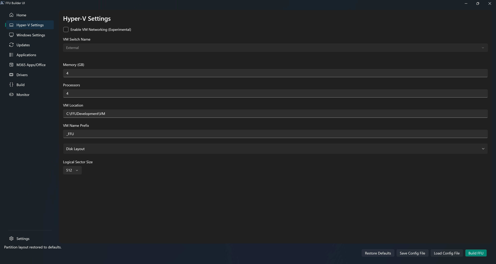

# Hyper-V Settings

## Enable VM Networking (Experimental)

Controls whether the build VM is connected to a Hyper-V switch during provisioning.

Leave this off for the default offline build path. Turn it on only if you want to test internet-connected builds and understand there may be Sysprep or capture issues.

## VM Switch Name

Drop down of detected VM Switches. There's also an **Other** option which allows you to specify a VM Switch Name. The other option is useful in scenarios where the machine you're running the UI from isn't going to be the machine where you plan to build the FFU from.

This setting is only used when **Enable VM Networking (Experimental)** is turned on. VM-based builds still capture from the host-side VHDX after the VM shuts down, so you only need a switch when the VM requires network connectivity during provisioning.

## Memory (GB)

Amount of memory to allocate for the virtual machine. Recommended to use 8GB if possible, especially for Windows 11. Default is 4GB.

## Processors

Number of virtual processors for the virtual machine. Recommended to use at least 4. Default is 4.

## VM Location

Default is `$FFUDevelopmentPath\VM`. This is the location of the VHDX that gets created where Windows will be installed to.

## VM Name Prefix

Prefix for the generated VM. Default is _FFU.

## Disk Layout

Configures the VHDX size and the build-time partition layout used for the captured FFU.

**Disk Size (GB)** sets the virtual hard disk size for the VM. Default is a 50GB dynamic disk. Increase this when the image needs more space for Windows, apps, updates, or data partitions.

The partition list shows the build order: System, MSR, Windows, Recovery, and optional data partitions. System, Windows, and Recovery have editable build-time drive letters. Defaults are `S`, `W`, and `R`. The MSR row is display-only, fixed at 16MB, and does not use a drive letter.

The System, Windows, and Recovery selections are host-side build letters only. Installed Windows uses `C:` for its Windows partition, while System and Recovery normally have no letter. The deployment script discovers these partitions from the applied disk instead of relying on the build letters.

Leave the Windows size blank to let Windows use the space remaining after Recovery and fixed-size data partitions are reserved. This allows you to give a data partition a fixed size while Windows uses the rest of the VHDX. If a data partition will use **Fill Remaining**, give Windows a fixed size first because only one partition can fill the remaining space.

Use the Recovery size only when you need a fixed Recovery partition size. Leave it blank to let the build calculate the Recovery size from `winre.wim` plus buffer space.

The Recovery partition can be removed by selecting its row checkbox and using **Remove Selected**. Use **Restore Recovery** to add it back before saving or building. Removing Recovery saves `CreateRecoveryPartition` as `false` in the generated config.

Each data partition has a name, a drive letter from `D:` through `Z:`, and either a size in GB or **Fill Remaining**. When FFU Builder installs applications in a build VM, the partition uses this configured letter before any application scripts run. Only one Windows or data partition can use **Fill Remaining**. Data partitions can be reordered with the arrow buttons. **Clear** removes only data partitions, not the base partition rows.

When you provide a Windows ISO, Windows temporarily assigns the mounted ISO a host drive letter. If that letter is configured for a build partition, FFU Builder moves only the Windows ISO to another unused letter before creating the VHDX partitions. An ISO that does not conflict keeps its original mounted letter.

Use **Reset to Default** to restore the System, MSR, Windows, and Recovery rows and remove all additional data partitions. The reset restores the default `S:`, `W:`, and `R:` build letters, makes Windows use **Fill Remaining**, and returns Recovery to automatic sizing. It does not change **Disk Size** or **Logical Sector Size**.

**Persist Drive Letter** is off by default and controls whether the configured letter is also required on a physical device. The build VM uses the configured letter whether or not this option is selected. When selected, FFU Builder requires the same letter when a deployed device enters the Windows `specialize` pass. When cleared, the partition receives the lowest available letter from `D:` upward in data-partition order.

During `specialize`, FFU Builder reserves configured persisted letters and letters owned by unrelated volumes before assigning unchecked partitions. If recognized FFU deployment media occupies a needed letter, all lettered partitions on that USB or removable disk are shifted to the next available letters after the internal data partitions. FFU Builder does not move unrelated volumes or file-system mappings; a configured-letter conflict with one of those owners stops deployment.

Windows PE drive letters are temporary and can change when hardware is detected, so assigning a letter only in PE does not provide the installed-Windows guarantee. See [WinPE: Identify drive letters with a script](https://learn.microsoft.com/windows-hardware/manufacture/desktop/winpe-identify-drive-letters?view=windows-11). First-boot enforcement runs in a hidden Windows PowerShell session. Successful enforcement removes its temporary script and manifest and leaves the diagnostic log at `C:\Windows\Temp\FFUDataPartitionDriveLetters.log`.

The Apps ISO drive letter is discovered at runtime. If you create a data partition that uses `D:`, application installs should use `%FFUAppsRoot%` for Apps ISO paths. Legacy `D:\` paths in `UserAppList.json` are still supported when they point to files on the Apps ISO.

## Logical Sector Size

Uint32 value of 512 or 4096. Useful for 4Kn drives or devices shipping with UFS drives. Default is 512.

There is some error-handling in the script that will call out mismatch issues with logical sector size. Unfortunately you will need to create a new FFU with the correct logical sector size as you can't convert a previously created FFU. Most should be fine with 512, but lower-end devices that used to ship with eMMC drives have now shifted to using UFS.


